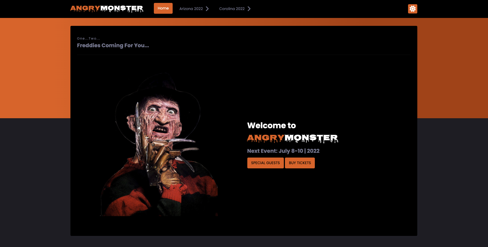

# Angry Monster -

This is a personal copy of the [Mad Monster Event](https://madmonster.com/)

## Overview

Mad Monster is an event that I have attended with my Fiance. Being that I have visited the site, I wanted to create my own version of the site.

As of March of 2022:

- Website is friendly on Mobile, Tablet and Larger screens
- The Home, Guests and Tickets pages are up
- User can toggle between Light and Dark Mode

### Screenshot

### Links

- [View Github Code](https://github.com/jchapar/angryMonster)
- [Visit Site](https://jchapar.github.io/angryMonster/)

### Built with

- Semantic HTML5 markup
- CSS custom properties
- Flexbox
- CSS Grid
- Mobile-first workflow

### What I learned

- The Home layout was retrieved from a youtube video by Julio Code [Julio Codes](https://www.youtube.com/watch?v=rkkxpGEYDFo)
- I learned techniques required to create the intergrated navbar items as well as the Orange highlight styling used on some of the card components
- In addition to using the layout design from the video, I created the additional guest and price pages
- Added JS styling to the navbar for the opacity change once scrolling has occured
- Added the Welcome loader when the page first loads

## Author

- Frontend Mentor - [@jchapar](https://www.frontendmentor.io/profile/jchapar)
- Twitter - [@j_chapar](https://www.twitter.com/j_chapar)
